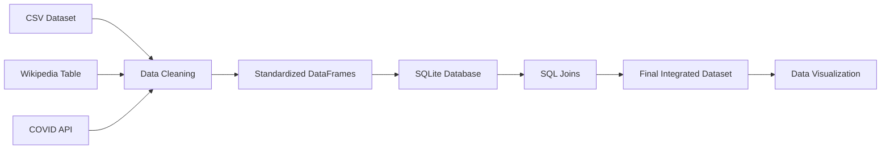
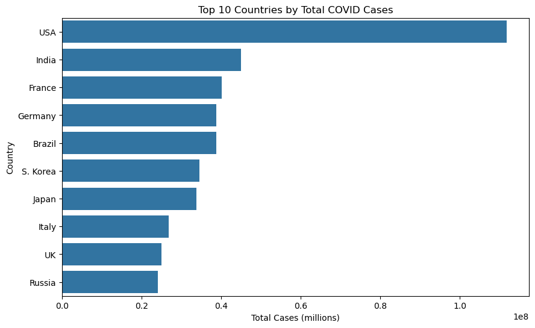
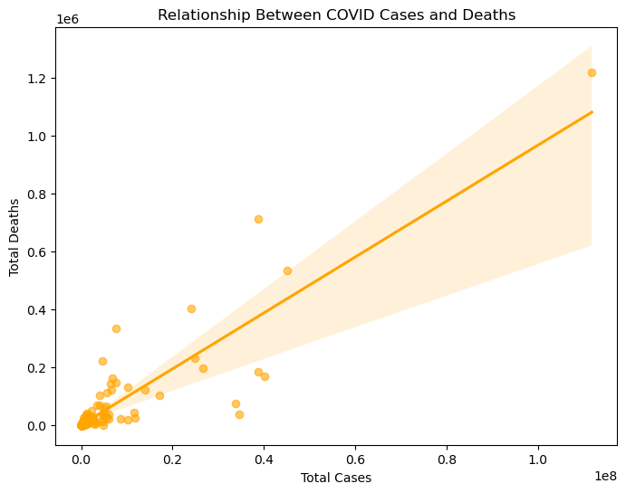
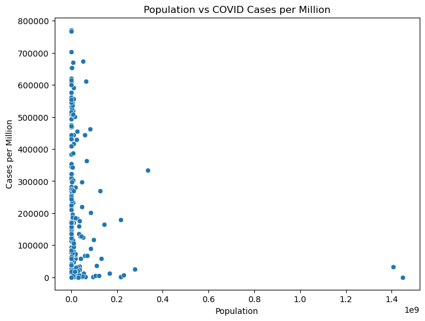
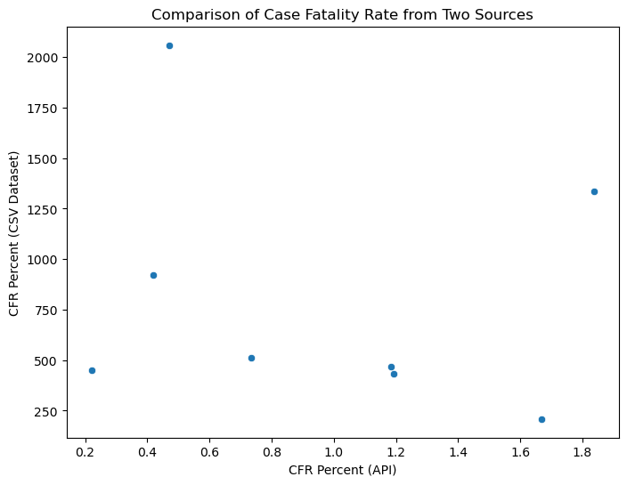
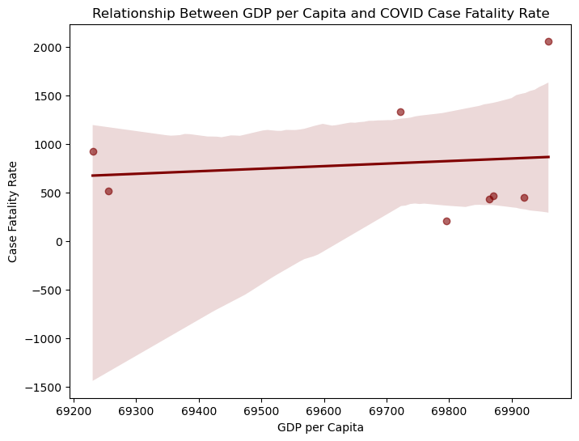

# COVID-19 Data Integration and Visualization Project

## Overview

This project demonstrates a complete **data preparation and analysis pipeline** using COVID-19 data from multiple sources. The goal was to clean, transform, and integrate several datasets into a structured database and generate meaningful visualizations that reveal patterns in the data.

Three separate datasets were processed and combined into a single analytical dataset using **SQLite and SQL joins**. Python libraries such as **Pandas, Matplotlib, and Seaborn** were then used to analyze the data and create visualizations that highlight relationships between COVID-19 cases, deaths, population statistics, and economic indicators across countries.

---

# Project Objectives

* Clean and transform multiple datasets from different sources
* Load processed data into a relational database
* Combine datasets using SQL joins
* Create visualizations to analyze global COVID-19 trends
* Address ethical considerations when cleaning and integrating data

---

# Data Sources

This project integrates three datasets:

### 1️ - CSV Dataset

Country-level COVID statistics including:

* total cases
* deaths
* case fatality rate

### 2️ - Wikipedia Dataset (Web Scraping)

Global COVID statistics such as:

* deaths per million
* total deaths
* total cases

### 3️ - Public API

Real-time COVID data including:

* population
* testing statistics
* vaccination metrics
* economic indicators

All datasets were cleaned and standardized to ensure consistent **country naming conventions** and compatible formats.

---

# Technologies Used

* **Python**
* **Pandas** – data cleaning and transformation
* **SQLite** – database storage
* **SQL** – joining and querying datasets
* **Matplotlib & Seaborn** – data visualization
* **Jupyter Notebook** – project workflow

---

# Data Pipeline Architecture

The project follows a typical **data engineering pipeline**:



This workflow demonstrates how raw datasets are transformed into a structured analytical dataset.

---

# Database Structure

Each dataset was stored as a separate table:

| Table Name   | Description                |
| ------------ | -------------------------- |
| `dataset_m2` | Cleaned CSV dataset        |
| `dataset_m3` | Web-scraped Wikipedia data |
| `dataset_m4` | API dataset                |

These tables were joined using SQL based on the **country** column to create a consolidated dataset.

---

# Visualizations

The project includes several visualizations exploring global COVID-19 trends.

### Top 10 Countries by Total COVID Cases



---

### Relationship Between Cases and Deaths



---

### Population vs Cases per Million



---

### Comparison of Case Fatality Rate Across Sources



---

### GDP per Capita vs COVID Fatality Rate



---

# Key Learnings

This project highlighted several important data preparation concepts:

* The importance of **data cleaning and standardization**
* Handling **time-series data with multiple records per entity**
* Using **SQL joins to integrate multiple datasets**
* Creating visualizations that clearly communicate insights

It also demonstrated how combining **health and socioeconomic indicators** can provide deeper insight into pandemic outcomes.

---

# Ethical Considerations

Data cleaning and transformation can significantly influence analytical outcomes. Removing missing values, standardizing formats, or merging datasets can unintentionally introduce bias if not carefully documented.

Additionally, COVID-19 data reporting standards vary across countries. Differences in testing rates, reporting methodologies, and data availability may affect comparisons between countries. Maintaining transparency and acknowledging these limitations is essential for responsible data analysis.

---

# Repository Structure

```
COVID-Data-Project
│
├── Milestone2.ipynb
├── Milestone3.ipynb
├── Milestone4.ipynb
├── Milestone5.ipynb
│
├── milestone2.csv
├── milestone3.csv
├── milestone4.csv
│
├── covid_project.db
│
├── images
│   ├── top_cases_chart.png
│   ├── cases_vs_deaths.png
│   ├── population_cases.png
│   ├── cfr_comparison.png
│   └── gdp_fatality.png
│
└── README.md
```

---

# Author

Venkat Patnaik
Bellevue University
DSC540 – Data Preparation
